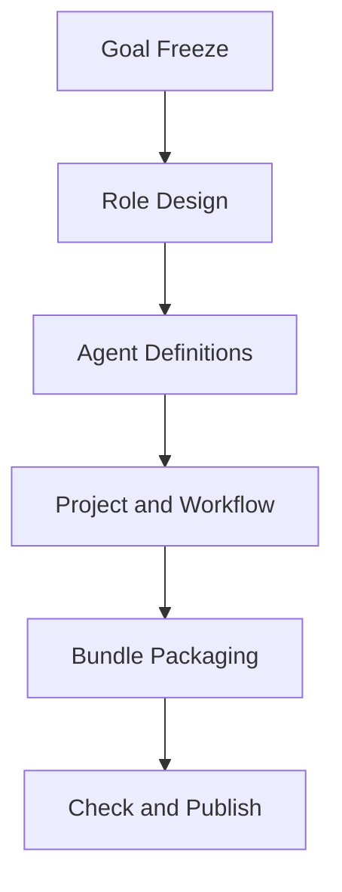

# Planning Checklist

Lock these items before writing the final bundle:

- target workspace path
- backend `base_url` if it is not the local default
- bundle ID, project ID, template ID, and run ID strategy
- reusable roles to create
- agent list, responsibilities, and skill bindings
- skills that must be copied into `skills/`
- project closure and routing constraints
- workflow tasks, owners, dependencies, write sets, and artifacts
- final evidence files expected under `reports/`

## Workflow Confirmation Gate

If the bundle contains a workflow:
- draft the workflow structure before editing final JSON
- present it as Markdown Mermaid
- wait for explicit user confirmation
- only then write `workflow_template`, `workflow_run`, and the final bundle

Example shape:

